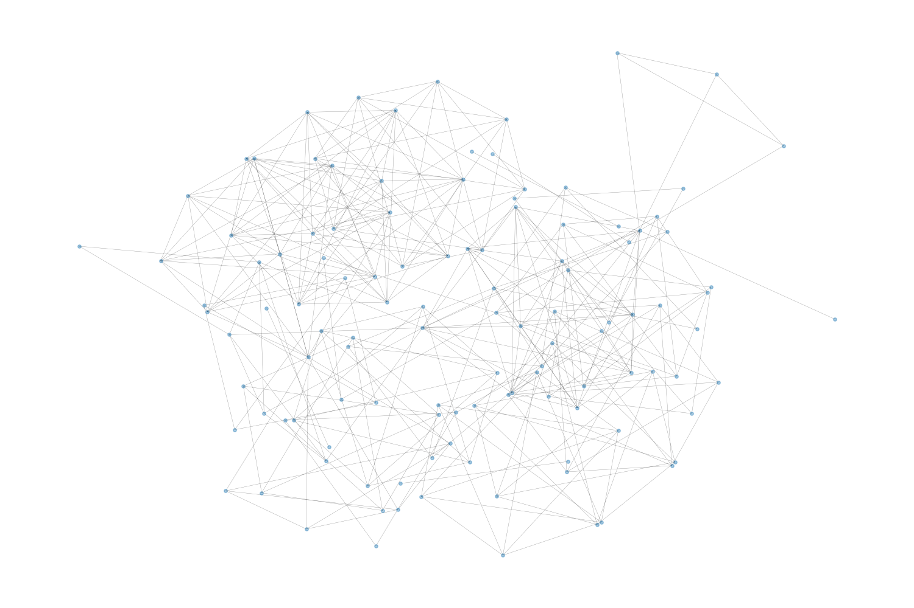
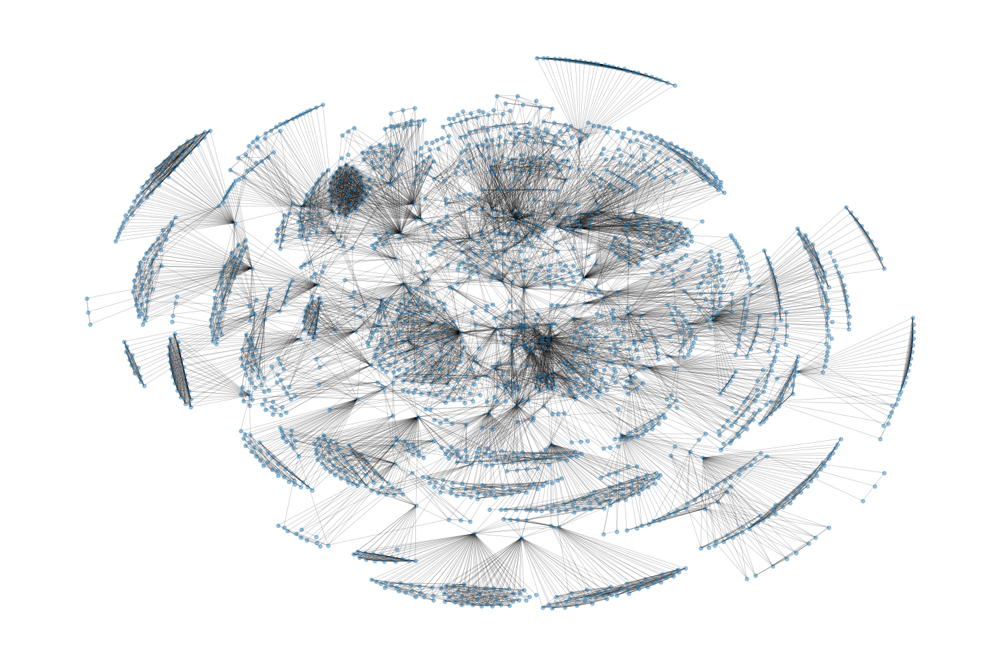

# author-graph
## Overview
This project builds a graph of co‑author relationships for the CHIWORK conferences and then expands that network using “snowball” crawling on each author’s profile. The resulting graph can be visualised, analysed and enriched with additional information such as author email addresses.

## Key Components

### Scraping Conference Proceedings

The function `crawl_proceedings` (`src/generate_graph/proceedings_base.py`) fetches a CHIWORK proceedings page with `requests` and parses it using BeautifulSoup. It collects all paper listings, optionally filters for open/free access, and extracts authors and paper metadata via `extract_nodes_edges`.

``` python
from generate_graph.proceedings_base import crawl_proceedings

# Build nodes and edges for CHIWORK 2023 proceedings
nodes, edges, doi_url = crawl_proceedings(
    "https://dl.acm.org/doi/proceedings/10.1145/3596671",
    base_url_addon="https://dl.acm.org",
    open_access=False
)
```

### Building the Base Graph

The base graph is then built with NetworkX. The helper `expand_graph` (`src/generate_graph/utils.py`) takes nodes and edges, adds authors as nodes (with names as attributes), and inserts co-author edges containing paper details.

``` python
import networkx as nx
from generate_graph.utils import expand_graph

# start with an empty graph
g = nx.Graph()

# add nodes and edges obtained from crawl_proceedings
expand_graph(g, nodes, edges)

# write to disk for later use
nx.write_gml(g, "data/chiwork_base.gml")
```

### Extracting Nodes and Edges from Papers

`extract_nodes_edges` (`src/generate_graph/build_nodes_edges.py`) parses each HTML listing: grabs the title, DOI, access status, and assembles author nodes and co-author tuples.

**Collecting Metadata (Emails)**
`build_author_emails_store.ipynb` maps authors to email addresses. It loads the graph from GML, builds PDF URLs, downloads them with requests, and uses PyPDF2 to extract emails (ACM addresses filtered out). Optionally, `query_openai` matches names to emails.

``` python
import re, requests, io, PyPDF2

def get_emails(pdf_url):
    response = requests.get(pdf_url, stream=True)
    if response.content[:len(b"%PDF-")] != b"%PDF-":
        return []
    reader = PyPDF2.PdfReader(io.BytesIO(response.content))
    text = reader.pages[0].extract_text()
    return re.findall(r"[a-zA-Z0-9_.+-]+@[a-zA-Z0-9-]+\\.[a-zA-Z0-9-.]+", text)
```

### Snowball Expansion
To expand the base graph, `snowball.py` defines several crawlers:

* `nowball_abstracts`: fetches an author’s publications and reuses extract_nodes_edges.
* `snowball_cheap`: scrapes a lightweight publication list.
* `snowball_expensive`: visits the colleagues page, fetches shared papers, and calls expand_graph to update.
* `snowball_generator`: wraps these functions, iterating over authors, handling errors, and logging progress.

The `build_graph.ipynb` notebook shows how to run snowball crawls across all nodes, resuming from checkpoints and saving updated graphs.

``` python
from generate_graph.snowball import snowball_generator

for author_id in list(g.nodes):
    success = snowball_generator(g, author_id)
    if not success:
        break  # handle IP blocks by resuming later
```

### Visualizing the Graph
`experiment.ipynb` demonstrates visualisation with NetworkX + Matplotlib, using a custom graph_vis function (Kamada–Kawai layout).

``` python
import matplotlib.pyplot as plt
import networkx as nx

def graph_vis(graph, image_path):
    pos = nx.kamada_kawai_layout(graph)
    plt.figure(figsize=(15, 10))
    nx.draw(graph, pos, node_size=15, alpha=0.4, width=0.3)
    plt.savefig(image_path)
```
**Initial Plot of CHIWork '22 and '23**


**Expanded Abstracts Graph After 1 Snowball Cycle**


### Analyzing Author Similarity
Finally, `experiment_heuristic_titles.ipynb` explores author similarity:

* TF-IDF + cosine similarity: vectorises titles with scikit-learn.
* LDA: builds topic distributions (Gensim) and compares with Hellinger distance.
* BERT embeddings: uses Hugging Face models to compute semantic similarity.

These methods suggest how to weight edges or recommend collaborators by topical or semantic closeness.

